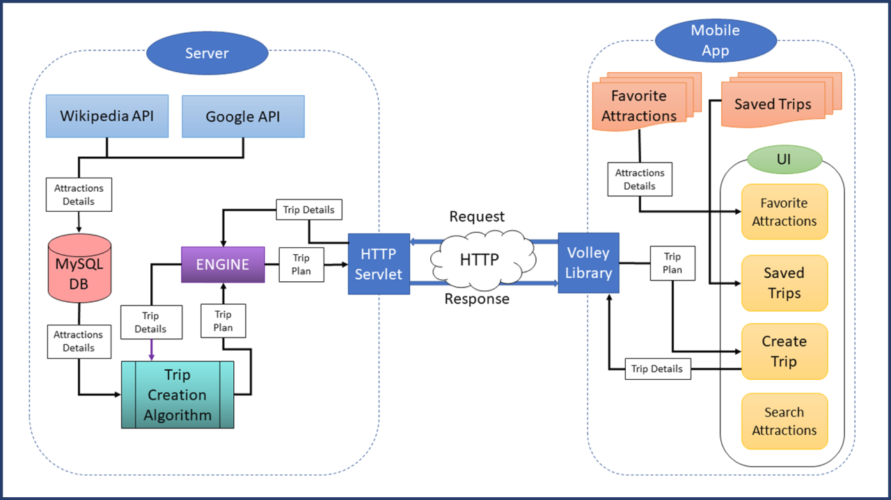

Planning an enjoyable and fully utilized trip involves several factors. While choosing a destination and dates.
Traveling are simple parts, building an optimal route is a relatively difficult and tiring part.
That's why we developed the TUP app, which allows the user to create a personalized travel itinerary according to his requirements.
With the help of an artificial intelligence algorithm, Hill Climbing, we create a personalized travel itinerary for the user, depending on the destination, travel dates, hours in which he wishes to travel during the days of the trip, and attractions he will definitely want to visit.

## Stack

 - **Data Base-** MySQL
 - **APIs**- Wikipedia API, Google API
 - **Server Side**- Java, Maven, Tomcat 8.5, Amazon RDS, Amazon Elastic Beanstalk
 - **Client Side**- Java, XML
 - **Libraries** - Volley, Glide, Gson(Google)

https://user-images.githubusercontent.com/58370322/227768729-fe6541b9-bc40-4d0c-a089-a6491a46b8ea.mp4

## Full app Architecture

